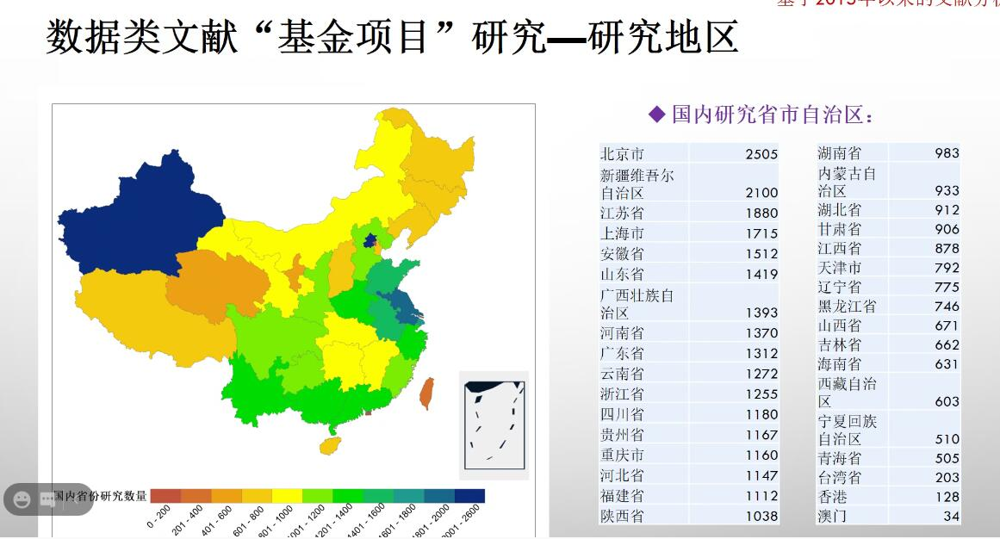
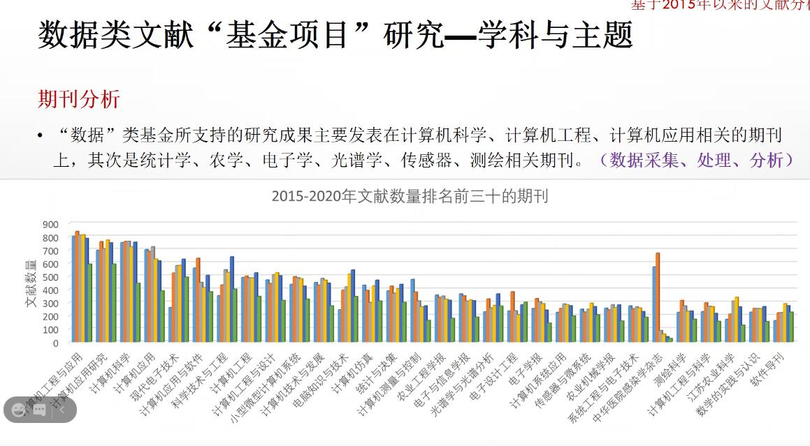
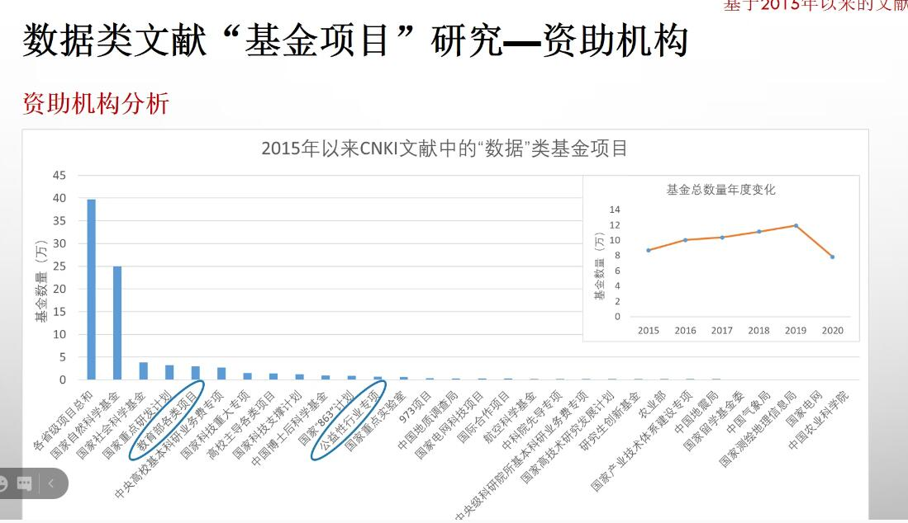
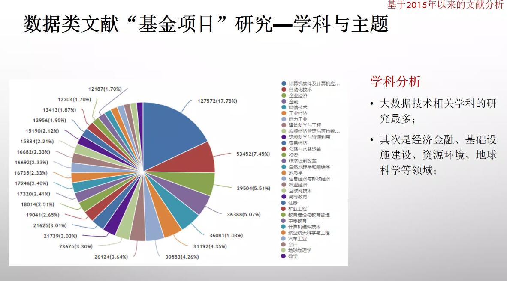
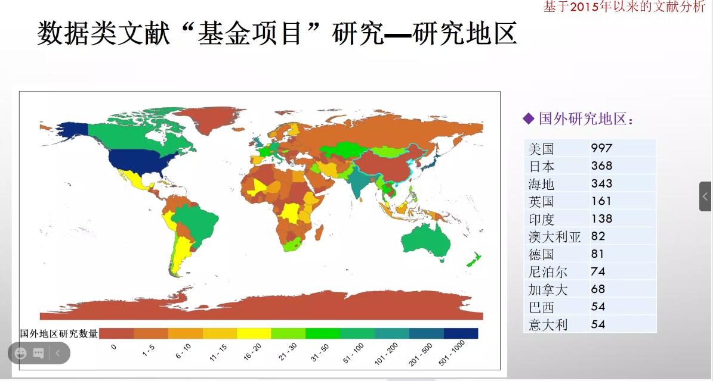
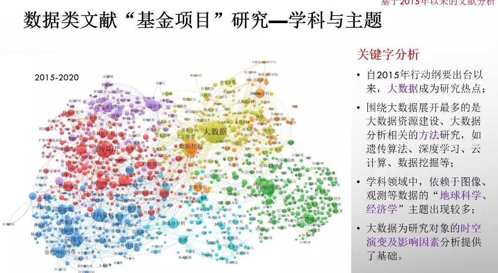
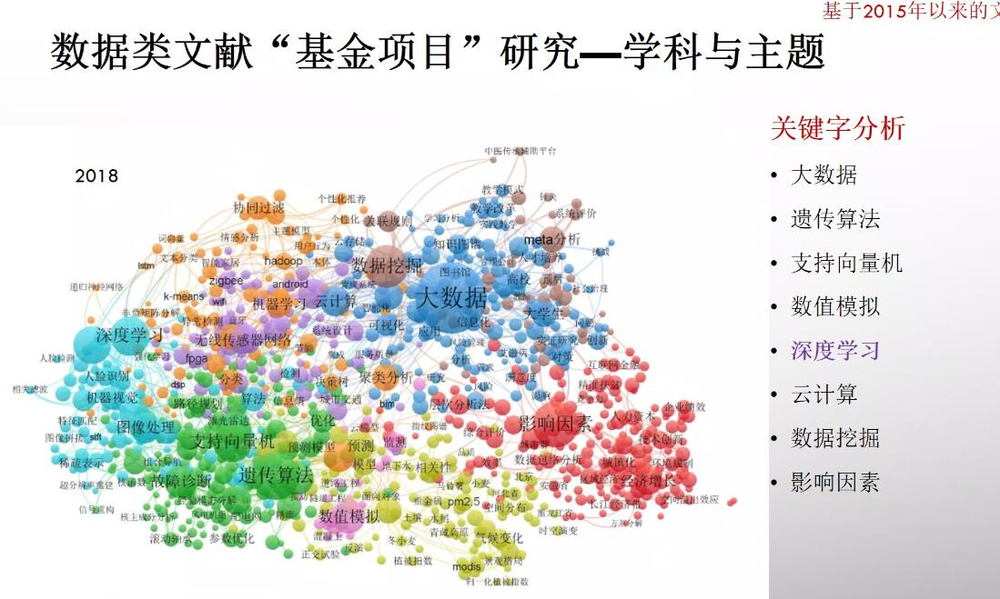
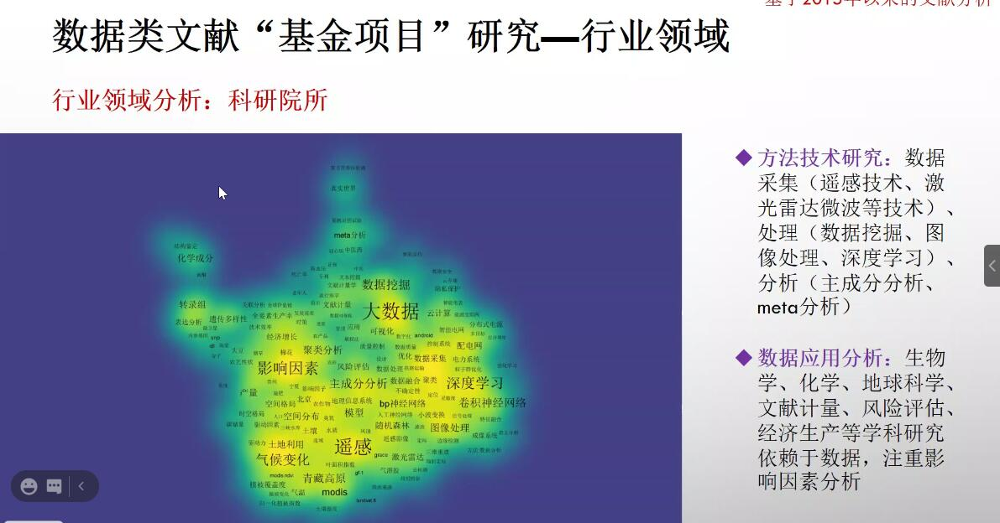

# 0 准备

##### 从 E:\workspace\workspace-js\scitools 复制来的项目

##### 西工大图书馆 http://login.lib-ycfw.xatu.edu.cn/frontend/web/index.php 
##### 用户名 2000021563 密码 zn2000021563

# 1 原则

## 1.1 流程化

把知识图谱的开发流程分为多个部分，包括解析文件、清洗数据、细化知识单元、构建知识关系、构建指标体系、绘制图谱、解读结果、生成报告、导出数据。

数据清洗和解析，可以做成cs端；数据展现，可以做成bs端。

### 1.1.1 解析文件

指的是把通过网络或者爬虫工具获取的文本数据库或者网络资源中的数据，导入到该系统中。

导入文件的格式是 zip、rar、txt、csv、xml、json 等格式文件。这需要根据原始获得文件来确定。

根据不同的数据来源和不同的文件格式，进行解析。

解析后的结果保存到自定义的文件中。

用户可以查看数据，并以 excel 格式导出数据。

### 1.1.2 清洗数据

指定清洗数据的方式，包括数据一致性、删除重复数据、补全数据、过滤数据等。

用户选择清洗方式，并输入部分参数后，就可以进行清洗，并查看清洗结果并导出。

### 1.1.3 细化知识单元

按照不同的数据来源和数据的质量，对数据按照知识单元进行细化，比如题名、著者、机构、省份、国别、基金、关键词、期刊、日期、图表、参考文献、全文等等。不同格式，比如期刊、会议、报纸等，有不同的知识单元。

知识单元，尽可能细化，这有利于后续指标的定义和组合。

细化的过程中，注意同名作者的处理。可以不断整理并完善一个规则库。

### 1.1.4 构建知识关系

指的是知识单元之间的关系，比如共词、共引、共被引、共著者、共来源等。

这是基于知识单元构建的知识组合。

### 1.1.5 构建指标体系

指的是在知识单元、知识关系基础上，构建的一系列指标体系。指标体系是分层级的，越靠近底层的指标越具体越细化，高层的指标是由底层的指标构成的。

### 1.1.6 绘制图谱

根据不同的指标，用户可以选择不同的绘制图谱方式。

### 1.1.7 解读结果

### 1.1.8 生成报告

### 1.1.9 导出数据

# 2 指标体系

## 2.1 文献评价指标

### 2.1.1 年代分布
计算方法：SELECT pubyear, COUNT(1) AS count FROM ods_bib GROUP BY pubyear ORDER BY pubyear

### 2.1.2 国家的产出分布
计算方法：SELECT country , COUNT(1) AS count FROM ods_bib GROUP BY country ORDER BY count DESC 

### 2.1.3 地区的产出分布

### 2.1.4 机构的产出分布

计算方法：SELECT org, COUNT(1) AS count FROM (SELECT title, arrayJoin(orgs) AS org  FROM ods_bib) GROUP BY org ORDER BY count DESC
注：如果多机构合著，则每个机构一篇

### 2.1.5 一作的产出分布

### 2.1.6 著者的产出分布
计算方法：SELECT author, COUNT(1) AS count FROM (SELECT title, arrayJoin(authors) AS author FROM ods_bib) GROUP BY author ORDER BY count DESC
注：尚未对著者去重，没有去重冗余数据，如“本刊”、“编辑部”

### 2.1.7 期刊来源分布
计算方法:SELECT publication , COUNT(1) AS count FROM ods_bib GROUP BY publication ORDER BY count DESC 

### 2.1.8 基金支持历年分布

基金也要从多角度多维度分析。

### 2.1.9 基金类型分布

计算方法：SELECT fund, COUNT(1) AS count FROM (SELECT title, arrayJoin(funds) AS fund FROM ods_bib) GROUP BY fund ORDER BY count DESC

### 2.1.10 学科分布
应该根据分类号，确定具体的一二级学科
计算方法: 

### 2.1.11 论文合著人数统计

计算方法：SELECT LENGTH (authors) as persons, COUNT(1) AS count FROM  ods_bib WHERE LENGTH(authors)>0 GROUP BY persons ORDER BY count DESC

### 2.1.12 关键词的词频分布

计算方法: SELECT kw, COUNT(1) AS count FROM (SELECT title, arrayJoin(kws) AS kw FROM ods_bib) GROUP BY kw ORDER BY count DESC

### 2.1.13 主题词的词频分布
主题词指的是从标题、摘要中切词，并加入关键词
计算方法: SELECT tw, COUNT(1) AS count FROM (SELECT title, arrayJoin(arrayConcat(title_words, kws, summary_words)) AS tw FROM ods_bib) GROUP BY tw ORDER BY count DESC

## 2.2 绘制词云

### 2.2.1 关键词词云

### 2.2.2 主题词词云

## 2.3 共现评价指标

### 2.3.1 关键词共现

这里的关键词必须是高频词，否则数据量太大
计算方法: SELECT kws, hasAll(['aa','bb'], kws) from default.ods_bib ob 

### 2.3.2 主题词共现
计算方法:

### 2.3.3 作者合作分布

这里的作者必须是高产作者，否则计算量太大
计算方法: SELECT authors ,hasAll(['aa','bb'], authors) from default.ods_bib ob 

### 2.3.4 基金共现

### 2.3.5 机构合作分布

这里的机构必须是高产机构，否则计算量太大
计算方法: SELECT orgs ,hasAll(['aa','bb'], orgs) from default.ods_bib ob 

### 2.3.6 国家合作分布
计算方法:

## 2.4 网络聚类

### 2.4.1 关键词的时间分布

按照年份、关键词分组汇总
计算方法: SELECT kw, pubyear ,COUNT(1) AS count FROM (SELECT pubyear ,arrayJoin(kws) AS kw FROM ods_bib) GROUP BY kw, pubyear ORDER BY kw, pubyear

### 2.4.2 主题词的时间分布

主题词指的是从标题、摘要中切词，并加入关键词
按照年份、主题词分组汇总
计算方法: SELECT tw, pubyear, COUNT(1) AS count FROM (SELECT pubyear , arrayJoin(arrayConcat(title_words, kws, summary_words)) AS tw FROM ods_bib) GROUP BY tw, pubyear ORDER BY tw, pubyear

### 2.4.3 共词、合著的社会网络分析

中心性分析包括点度中心性、接近中心性、中间中心性。

### 2.4.4 相关分析

### 2.4.5 社团分析

### 2.4.6 关键词的时间聚类分析

### 2.4.7 关键词的行业领域聚类

## 2.5 知识图谱

## 2.6 著者评价指标

## 2.7 机构评价指标

## 2.8 国家评价指标

## 2.9 期刊评价指标

### 总被引频次

是指该刊自创刊以来所登载的全部论文在统计当年被引用的总次数。
可以比较客观的说明该刊物总体被使用和受重视的程度，以及在学术交流中的地位和作用。
对于新刊物不利。

### 影响因子

是指该刊前两年发表的论文在评价当年的被引用次数除以该刊在两年内发表的论文总数。
国际通用指标。

### 即年指标

又称当年指标，是指该刊当年发表的论文被引用的次数除以该刊当年发表的论文总数。这事一个表征期刊即时反应速度的指标，主要描述期刊当年发表的论文在当年被引用的情况。

### 载文量

是指统计当年该刊发表的论文总数。

### 基金论文比

统计当年期刊全部论文中各类基金和重大项目自主的论文所占的比例，它是衡量期刊论文学术质量的重要指标。

### 平均引用数

统计当年该刊全部参考文献数与该刊当年发表的全部论文之比。

### 他引率

### h 指数

## 

## 

## 
